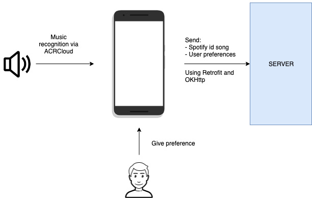

# AndroidTesi
Android application for my master's degree thesis. It's used by people for giving preference on a certain track listened during workout.

Technologies involved:
- ACRCloud
- Retrofit and OKHttp

